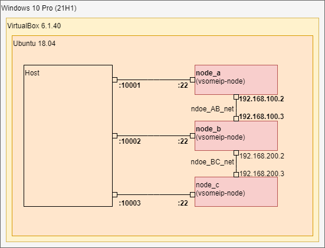

- [1. 概要](#1-概要)
  - [1.1. 目的](#11-目的)
  - [1.2. 環境](#12-環境)
- [2. 環境構築](#2-環境構築)
  - [2.1. WindowsにVirtualBoxをインストール](#21-windowsにvirtualboxをインストール)
  - [2.2. VirtualBoxのExtension Packをインストール](#22-virtualboxのextension-packをインストール)
  - [2.3. VirtualBoxにUbuntuをインストール](#23-virtualboxにubuntuをインストール)
  - [2.4. Ubuntuに各種パッケージをインストールする](#24-ubuntuに各種パッケージをインストールする)
  - [2.5. UbuntuにDockerをインストール](#25-ubuntuにdockerをインストール)
  - [2.6. UbuntuにDocker Composeをインストール](#26-ubuntuにdocker-composeをインストール)
- [3. Dockerコンテナの作成](#3-dockerコンテナの作成)
  - [3.1. 本リポジトリをクローン](#31-本リポジトリをクローン)
  - [3.2. イメージのビルド](#32-イメージのビルド)
  - [3.3. Dockerコンテナの作成](#33-dockerコンテナの作成)
- [4. vsomeipサーバー/クライアントのビルド・実行](#4-vsomeipサーバークライアントのビルド実行)
  - [4.1. vsomeipサーバー/クライアントのビルド](#41-vsomeipサーバークライアントのビルド)
  - [4.2. vsomeipサーバー/クライアントの実行](#42-vsomeipサーバークライアントの実行)
    - [4.2.1. クライアント側](#421-クライアント側)
    - [4.2.2. サーバー側](#422-サーバー側)
  - [4.3. vsomeipサーバー/クライアントの実行結果](#43-vsomeipサーバークライアントの実行結果)
    - [4.3.1. クライアント側](#431-クライアント側)
    - [4.3.2. サーバー側](#432-サーバー側)

## 1. 概要

### 1.1. 目的

- vsomeipサーバー/クライアントのビルド
- WiresharkによるSOME/IPパケット解析

> **Note**
> 
> Dockerを用いた環境構築や、vsomeipサーバー/クライアントのビルド手順はこちらの記事を参考にさせていただきました。
> - [Dockerを用いてVSOMEIPを使ってみる - 作業中のメモ](https://workspacememory.hatenablog.com/entry/2020/11/08/193105)


### 1.2. 環境

|項目|バージョン|
|-|-|
|OS| Windows 10 Pro 64bit 21H1 19043.2364|
|VirtualBox|6.1.40|
|OS(VM)|Ubuntu 18.04.6|
|Docker|23.0.1, build a5ee5b1|
|Docker Compose|v2.16.0|
|vsomeip|3.1.16.1|



## 2. 環境構築

### 2.1. WindowsにVirtualBoxをインストール

公式サイトから実行ファイルをダウンロードしインストールする。
- https://www.virtualbox.org/wiki/Download_Old_Builds_6_1


### 2.2. VirtualBoxのExtension Packをインストール

VirtualBox本体をインストールした後、「Extension Pack」をダウンロードし、ダブルクリックすると拡張機能をインストールすることができる。（拡張機能により、USB3.0やリモートデスクトップなどが追加されるらしい。）

- https://www.virtualbox.org/wiki/Download_Old_Builds_6_1


### 2.3. VirtualBoxにUbuntuをインストール

Desktop版のISOイメージをダウンロードし、VirtualBoxにインストールする。

- https://ftp.riken.jp/Linux/ubuntu-releases/18.04.6/

VirtualBoxにUbuntuをインストールする手順は割愛します。

### 2.4. Ubuntuに各種パッケージをインストールする

```bash
sudo apt update
sudo apt install git
```


### 2.5. UbuntuにDockerをインストール

公式サイトの手順に従って、UbuntuにDockerをインストールする。

- https://docs.docker.com/engine/install/ubuntu/

インストール：
```bash
# Uninstall old versions
sudo apt-get remove docker docker-engine docker.io containerd runc

# Set up the repository
## 1. Update the apt package index and install packages to allow apt to use a repository over HTTPS:
sudo apt-get update
sudo apt-get install \
    ca-certificates \
    curl \
    gnupg \
    lsb-release

## 2. Add Docker’s official GPG key:
sudo mkdir -m 0755 -p /etc/apt/keyrings
curl -fsSL https://download.docker.com/linux/ubuntu/gpg | sudo gpg --dearmor -o /etc/apt/keyrings/docker.gpg

## 3. Use the following command to set up the repository:
echo \
  "deb [arch=$(dpkg --print-architecture) signed-by=/etc/apt/keyrings/docker.gpg] https://download.docker.com/linux/ubuntu \
  $(lsb_release -cs) stable" | sudo tee /etc/apt/sources.list.d/docker.list > /dev/null

# Install Docker Engine
sudo apt-get update
sudo apt-get install docker-ce docker-ce-cli containerd.io docker-buildx-plugin docker-compose-plugin
```

Dockerがインストールできたかどうか確認する：
```bash
sudo docker run hello-world
```

### 2.6. UbuntuにDocker Composeをインストール

公式サイトの手順に従い、Docker Composeをインストールする。

- https://docs.docker.com/compose/install/linux/

インストール：
```bash
sudo apt-get update
sudo apt-get install docker-compose-plugin
```

バージョン確認：
```bash
sudo docker compose version
# Docker Compose version vN.N.N
```

## 3. Dockerコンテナの作成

> **Note**
>
> DockerイメージのビルドはUbuntu上で行います。

### 3.1. 本リポジトリをクローン
```bash
git clone https://github.com/akigi/vsomeip-test
cd vsomeip-test
```

本リポジトリのフォルダ構成：
```
vsomeip-test
    - docker
        - vsomeip-build    #使用しない
            - Dockerfile
            - start.sh
        - vsomeip-node     #ビルドする
            - Dockerfile
            - start.sh
        - vsomeip-compose  #vsomeip-nodeからnode_a~cコンテナを立ち上げる
            - code         #コンテナ間の共有フォルダ(COVESA/vsomeipリポジトリの中身)
            - docker-compose.yaml
```

### 3.2. イメージのビルド

イメージをビルドします。

```bash
sudo docker build -t akigi/vsomeip-node:latest ./docker/vsomeip-node
```

> **Note**
> または、下記のコマンドでビルドすることもできます。
> ```bash
> bash ./docker/docker-build.sh vsomeip-node
> ```

イメージ一覧を確認します。

```bash
sudo docker images
```

### 3.3. Dockerコンテナの作成

Docker ComposeによりDockerコンテナーを作成します。

```bash
cd ./docker/vsomeip-compose
sudo docker compose up -d
# node_a
# node_b
# node_c
```

コンテナが起動していることを確認します。

```bash
sudo docker ps -a

CONTAINER ID   IMAGE                       COMMAND         CREATED        STATUS                      PORTS     NAMES
9d4ffbca1b23   akigi/vsomeip-node:latest   "/start.sh"     10 hours ago   Up 10 hours                           node_a
3fdf12fb1917   akigi/vsomeip-node:latest   "/start.sh"     10 hours ago   Up 10 hours                           node_b
9e7b4a960c9e   akigi/vsomeip-node:latest   "/start.sh"     10 hours ago   Up 10 hours                           node_c
```

## 4. vsomeipサーバー/クライアントのビルド・実行

### 4.1. vsomeipサーバー/クライアントのビルド

```bash
# コンテナ内に入る（ここではNodeA）
sudo docker exec -it node_a bash

# =======================
# 以下，NodeAコンテナ内での作業
# =======================
# /code/examplesに移動
cd /code/examples
# build用ディレクトリの作成
mkdir build
# build用ディレクトリ内に移動
cd build
# コンパイル
g++ -o request-sample  ../request-sample.cpp  -I/usr/local/vsomeip/include -L/usr/local/vsomeip/lib -lvsomeip3 -lpthread
g++ -o response-sample ../response-sample.cpp -I/usr/local/vsomeip/include -L/usr/local/vsomeip/lib -lvsomeip3 -lpthread
```

### 4.2. vsomeipサーバー/クライアントの実行

#### 4.2.1. クライアント側

```bash
# NodeAに入る
 docker exec -it node_a bash
# 移動
cd /code/examples/build
# プログラムを実行
LD_LIBRARY_PATH=/usr/local/vsomeip/lib VSOMEIP_CONFIGURATION=vsomeip-udp-client.json VSOMEIP_APPLICATION_NAME=client-sample ./request-sample
```

#### 4.2.2. サーバー側

```bash
# NodeBに入る
 docker exec -it node_b bash
# 移動
cd /code/examples/build
# プログラムを実行
LD_LIBRARY_PATH=/usr/local/vsomeip/lib VSOMEIP_CONFIGURATION=vsomeip-udp-service.json VSOMEIP_APPLICATION_NAME=service-sample ./response-sample
```

### 4.3. vsomeipサーバー/クライアントの実行結果

#### 4.3.1. クライアント側
```log
-- [client-sample] -- use_tcp:		0
-- [client-sample] -- be_quiet:		0
-- [client-sample] -- cycle:		1000
-- [client-sample] -- Calling Init
-- [client-sample] -- SAMPLE_SERVICE_ID:	4660
-- [client-sample] -- SAMPLE_INSTANCE_ID:	22136
-- [client-sample] -- SAMPLE_METHOD_ID:	1057
2023-01-12 14:48:00.599932 [info] Parsed vsomeip configuration in 1ms
2023-01-12 14:48:00.601450 [info] Using configuration file: "vsomeip-udp-client.json".
2023-01-12 14:48:00.601682 [info] Initializing vsomeip application "client-sample".
2023-01-12 14:48:00.602345 [info] Instantiating routing manager [Host].
2023-01-12 14:48:00.603835 [info] create_local_server Routing endpoint at /tmp/vsomeip-0
2023-01-12 14:48:00.615748 [info] Service Discovery enabled. Trying to load module.
2023-01-12 14:48:00.623948 [info] Service Discovery module loaded.
2023-01-12 14:48:00.749998 [info] Application(client-sample, 1343) is initialized (11, 100).
Client settings [protocol=UDP:quiet=false:cycle=1000]
2023-01-12 14:48:00.753172 [info] Starting vsomeip application "client-sample" (1343) using 2 threads I/O nice 255
2023-01-12 14:48:00.760800 [info] Watchdog is disabled!
2023-01-12 14:48:00.824153 [info] shutdown thread id from application: 1343 (client-sample) is: 7ff4544c6700 TID: 29023
2023-01-12 14:48:00.828858 [info] main dispatch thread id from application: 1343 (client-sample) is: 7ff454cc7700 TID: 29022
2023-01-12 14:48:00.831403 [info] io thread id from application: 1343 (client-sample) is: 7ff455533ec0 TID: 29015
2023-01-12 14:48:00.845359 [info] vSomeIP 3.1.16.1 | (default)
2023-01-12 14:48:00.848823 [info] Network interface "eth0" state changed: up
2023-01-12 14:48:00.849577 [info] Route "default route (0.0.0.0/0) if: eth0 gw: 192.168.100.1" state changed: up
2023-01-12 14:48:00.852046 [info] udp_server_endpoint_impl: SO_RCVBUF is: 212992
Service [1234.5678] is NOT available.
Service [1235.5678] is NOT available.
2023-01-12 14:48:00.919117 [info] REQUEST(1343): [1234.5678:255.4294967295]
2023-01-12 14:48:00.935690 [info] Listening at /tmp/vsomeip-1343
2023-01-12 14:48:00.919883 [info] io thread id from application: 1343 (client-sample) is: 7ff4534c4700 TID: 29025
2023-01-12 14:48:00.987707 [debug] Joining to multicast group 224.244.224.245 from 192.168.100.2
2023-01-12 14:48:00.988216 [info] udp_server_endpoint_impl: SO_RCVBUF (Multicast) is: 212992
2023-01-12 14:48:00.988661 [info] SOME/IP routing ready.
2023-01-12 14:48:00.782345 [info] udp_client_endpoint_impl::connect: SO_RCVBUF is: 212992
Service [1234.5678] is available.
Client/Session [1343/0001] sent a request to Service [1234.5678]
Received a response from Service [1234.5678] to Client/Session [1343/0001]
Received a response from Service [1234.5678] to Client/Session [1343/000f]
Client/Session [1343/0002] sent a request to Service [1234.5678]
Received a response from Service [1234.5678] to Client/Session [1343/0002]
Service [1235.5678] is available.
Service [1234.5678] is NOT available.
Service [1235.5678] is NOT available.
2023-01-12 14:48:04.305742 [warning] Didn't receive a multicast SD message for 2200ms.
2023-01-12 14:48:04.306598 [debug] Leaving the multicast group 224.244.224.245 from 192.168.100.2
2023-01-12 14:48:04.307053 [debug] Joining to multicast group 224.244.224.245 from 192.168.100.2
2023-01-12 14:48:04.307418 [info] udp_server_endpoint_impl: SO_RCVBUF (Multicast) is: 212992
2023-01-12 14:48:06.375743 [warning] Didn't receive a multicast SD message for 2200ms.
2023-01-12 14:48:06.376144 [debug] Leaving the multicast group 224.244.224.245 from 192.168.100.2
2023-01-12 14:48:06.376468 [debug] Joining to multicast group 224.244.224.245 from 192.168.100.2
2023-01-12 14:48:06.376756 [info] udp_server_endpoint_impl: SO_RCVBUF (Multicast) is: 212992
2023-01-12 14:48:08.415417 [warning] Didn't receive a multicast SD message for 2200ms.
2023-01-12 14:48:08.415789 [debug] Leaving the multicast group 224.244.224.245 from 192.168.100.2
2023-01-12 14:48:08.416077 [debug] Joining to multicast group 224.244.224.245 from 192.168.100.2
2023-01-12 14:48:08.416544 [info] udp_server_endpoint_impl: SO_RCVBUF (Multicast) is: 212992
2023-01-12 14:48:09.178270 [info] Reboot detected: IP=192.168.100.3
2023-01-12 14:48:09.179826 [info] udp_client_endpoint_impl::connect: SO_RCVBUF is: 212992
Service [1234.5678] is available.
Service [1235.5678] is available.
Client/Session [1343/0003] sent a request to Service [1234.5678]
2023-01-12 14:48:10.295314 [info] Reboot detected: IP=192.168.100.3
2023-01-12 14:48:10.295871 [info] expire_services for address: 192.168.100.3 : delete service/instance 1234.5678 port [0,0] reliability=false
2023-01-12 14:48:10.296579 [info] udp_client_endpoint_impl::connect: SO_RCVBUF is: 212992
Service [1234.5678] is NOT available.
Service [1234.5678] is available.
2023-01-12 14:48:10.944579 [info] vSomeIP 3.1.16.1 | (default)
Received a response from Service [1234.5678] to Client/Session [1343/0011]
Client/Session [1343/0004] sent a request to Service [1234.5678]
Received a response from Service [1234.5678] to Client/Session [1343/3628]
Received a response from Service [1234.5678] to Client/Session [1343/0004]
2023-01-12 14:48:11.534545 [info] Reboot detected: IP=192.168.100.3
2023-01-12 14:48:11.535159 [info] expire_services for address: 192.168.100.3 : delete service/instance 1234.5678 port [0,0] reliability=false
2023-01-12 14:48:11.535883 [info] udp_client_endpoint_impl::connect: SO_RCVBUF is: 212992
Service [1234.5678] is NOT available.
Service [1234.5678] is available.
Client/Session [1343/0005] sent a request to Service [1234.5678]
2023-01-12 14:48:12.563889 [info] Reboot detected: IP=192.168.100.3
2023-01-12 14:48:12.564824 [info] expire_services for address: 192.168.100.3 : delete service/instance 1234.5678 port [0,0] reliability=false
2023-01-12 14:48:12.565777 [info] udp_client_endpoint_impl::connect: SO_RCVBUF is: 212992
Service [1234.5678] is NOT available.
Service [1234.5678] is available.
Client/Session [1343/0006] sent a request to Service [1234.5678]
2023-01-12 14:48:13.675367 [info] Reboot detected: IP=192.168.100.3
2023-01-12 14:48:13.675821 [info] expire_services for address: 192.168.100.3 : delete service/instance 1234.5678 port [0,0] reliability=false
2023-01-12 14:48:13.676439 [info] udp_client_endpoint_impl::connect: SO_RCVBUF is: 212992
Service [1234.5678] is NOT available.
Service [1234.5678] is available.
Client/Session [1343/0007] sent a request to Service [1234.5678]
2023-01-12 14:48:15.241619 [info] Reboot detected: IP=192.168.100.3
2023-01-12 14:48:15.242156 [info] expire_services for address: 192.168.100.3 : delete service/instance 1234.5678 port [0,0] reliability=false
2023-01-12 14:48:15.243269 [info] udp_client_endpoint_impl::connect: SO_RCVBUF is: 212992
Service [1234.5678] is NOT available.
Service [1234.5678] is available.
Client/Session [1343/0008] sent a request to Service [1234.5678]
2023-01-12 14:48:17.233813 [info] Reboot detected: IP=192.168.100.3
2023-01-12 14:48:17.234699 [info] expire_services for address: 192.168.100.3 : delete service/instance 1234.5678 port [0,0] reliability=false
2023-01-12 14:48:17.235576 [info] udp_client_endpoint_impl::connect: SO_RCVBUF is: 212992
Service [1234.5678] is NOT available.
Service [1234.5678] is available.
Client/Session [1343/0009] sent a request to Service [1234.5678]
2023-01-12 14:48:18.703353 [info] Reboot detected: IP=192.168.100.3
2023-01-12 14:48:18.704130 [info] expire_services for address: 192.168.100.3 : delete service/instance 1234.5678 port [0,0] reliability=false
2023-01-12 14:48:18.704919 [info] udp_client_endpoint_impl::connect: SO_RCVBUF is: 212992
Service [1234.5678] is NOT available.
Service [1234.5678] is available.
Client/Session [1343/000a] sent a request to Service [1234.5678]
2023-01-12 14:48:19.587882 [info] Reboot detected: IP=192.168.100.3
2023-01-12 14:48:19.589035 [info] expire_services for address: 192.168.100.3 : delete service/instance 1234.5678 port [0,0] reliability=false
Service [1234.5678] is NOT available.
```

#### 4.3.2. サーバー側

```log
-- [service-sample] -- Calling init
-- [service-sample] -- SAMPLE_SERVICE_ID:	4660
-- [service-sample] -- SAMPLE_INSTANCE_ID:	22136
-- [service-sample] -- SAMPLE_METHOD_ID:	1057
-- [service-sample] -- use_static_routing_:	0
2023-01-12 14:48:09.129103 [warning] Reliability type for event [1234.5678.8777] was not configured Using : RT_UNRELIABLE
2023-01-12 14:48:09.129787 [warning] Reliability type for event [1234.5678.8778] was not configured Using : RT_UNRELIABLE
2023-01-12 14:48:09.129840 [warning] Reliability type for event [1234.5678.8779] was not configured Using : RT_UNRELIABLE
2023-01-12 14:48:09.130533 [info] Parsed vsomeip configuration in 0ms
2023-01-12 14:48:09.130626 [info] Using configuration file: "vsomeip-udp-service.json".
2023-01-12 14:48:09.130732 [info] Initializing vsomeip application "service-sample".
2023-01-12 14:48:09.130910 [info] Instantiating routing manager [Host].
2023-01-12 14:48:09.131427 [info] create_local_server Routing endpoint at /tmp/vsomeip-0
2023-01-12 14:48:09.132183 [info] Service Discovery enabled. Trying to load module.
2023-01-12 14:48:09.134563 [info] Service Discovery module loaded.
2023-01-12 14:48:09.171706 [info] Application(service-sample, 1277) is initialized (11, 100).
Static routing OFF
2023-01-12 14:48:09.172447 [info] Starting vsomeip application "service-sample" (1277) using 2 threads I/O nice 255
2023-01-12 14:48:09.174943 [info] Watchdog is disabled!
2023-01-12 14:48:09.177518 [info] io thread id from application: 1277 (service-sample) is: 7f7c39cdcec0 TID: 29033
2023-01-12 14:48:09.178300 [info] vSomeIP 3.1.16.1 | (default)
2023-01-12 14:48:09.182603 [info] Network interface "eth0" state changed: up
2023-01-12 14:48:09.183126 [info] Route "default route (0.0.0.0/0) if: eth0 gw: 192.168.100.1" state changed: up
2023-01-12 14:48:09.183668 [info] udp_server_endpoint_impl: SO_RCVBUF is: 212992
2023-01-12 14:48:09.184102 [debug] Joining to multicast group 224.244.224.245 from 192.168.100.3
2023-01-12 14:48:09.184370 [info] udp_server_endpoint_impl: SO_RCVBUF (Multicast) is: 212992
2023-01-12 14:48:09.184602 [info] SOME/IP routing ready.
2023-01-12 14:48:09.191515 [info] shutdown thread id from application: 1277 (service-sample) is: 7f7c38c6f700 TID: 29040
2023-01-12 14:48:09.195166 [info] io thread id from application: 1277 (service-sample) is: 7f7c37c6d700 TID: 29042
2023-01-12 14:48:09.196335 [info] main dispatch thread id from application: 1277 (service-sample) is: 7f7c39470700 TID: 29039
Application service-sample is registered.
-- [service-sample] -- offer
2023-01-12 14:48:09.197766 [info] OFFER(1277): [1234.5678:0.0] (true)
2023-01-12 14:48:09.198774 [info] udp_server_endpoint_impl: SO_RCVBUF is: 212992
2023-01-12 14:48:09.208137 [info] Listening at /tmp/vsomeip-1277
2023-01-12 14:48:09.209356 [info] OFFER(1277): [1235.5678:0.0] (true)
Received a message with Client/Session [1343/0010]
Received a message with Client/Session [1343/3627]
Received a message with Client/Session [1343/0003]
2023-01-12 14:48:19.250281 [info] vSomeIP 3.1.16.1 | (default)
2023-01-12 14:48:19.548940 [info] STOP OFFER(1277): [1234.5678:0.0] (true)
2023-01-12 14:48:19.549702 [info] STOP OFFER(1277): [1235.5678:0.0] (true)
```